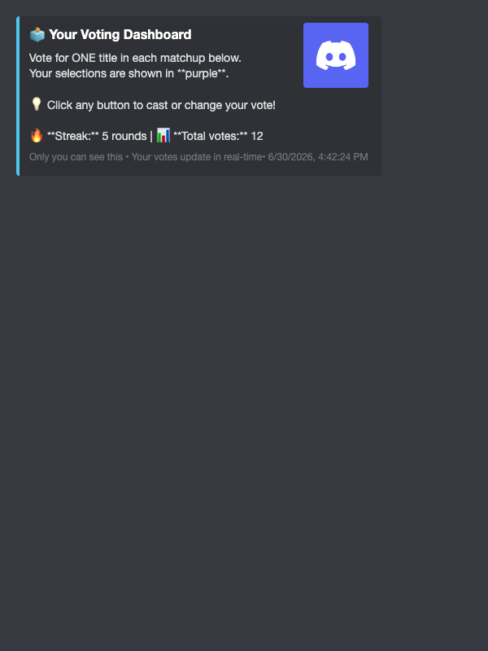
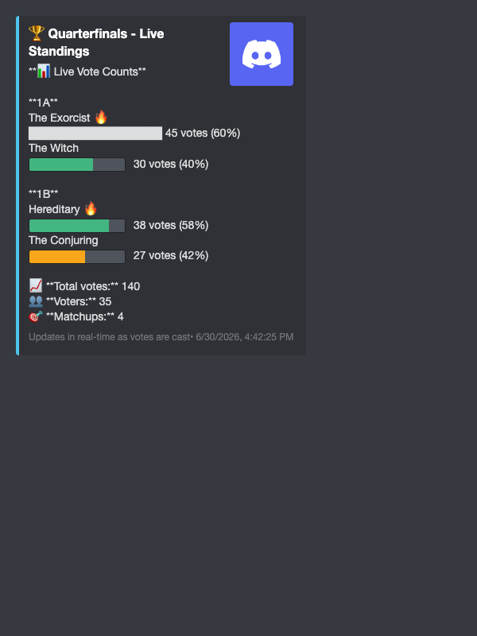
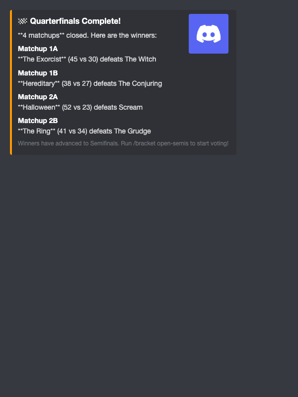

# Knockout Rounds

**Advance winners through single-elimination rounds** from Round of 32 through Finals. Features a regional bracket system with flexible opening options - open entire rounds, specific regions, or individual matchups for maximum control over tournament pacing.

## Regional Bracket System

**The bracket uses a regional identification system** to organize matchups into left and right sides of the bracket. This makes it easier to reference specific matchups and manage voting by region.

### Regional Labels

Each matchup has a **regional label** combining region number and letter:
- **Region 1 (Left Side)**: Matchups labeled 1A, 1B, 1C, 1D...
- **Region 2 (Right Side)**: Matchups labeled 2A, 2B, 2C, 2D...

**Examples by Round:**
- **Round of 16** (8 matchups): Left = 1A-1D, Right = 2A-2D
- **Quarterfinals** (4 matchups): Left = 1A-1B, Right = 2A-2B
- **Semifinals** (2 matchups): Left = 1A, Right = 2A
- **Finals**: No regional designation (just "Finals")

### Opening Options

You have **multiple ways** to open knockout matchups:

#### Round-Specific Commands (Recommended)

**The easiest way** - use memorable commands for each round:

- `/bracket open-quarters` - Open Quarterfinals (4 matchups)
- `/bracket open-semis` - Open Semifinals (2 matchups)  
- `/bracket open-finals` - Open Finals (1 matchup)

**Benefits:**
- Clear and memorable
- Self-documenting (command name shows what round)
- Bot suggests exact command after closing previous round
- Same `duration` parameter as generic commands

#### Generic Commands

**Fallback option** - works for any round:

1. **Entire Round**: `/bracket open-knockout` - Opens all matchups in current round
2. **Single Matchup**: `/bracket open-matchup matchup:1A` - Opens one specific matchup

#### Flexibility Benefits

This flexibility allows you to:
- Use round-specific commands for clarity (`/bracket open-finals`)
- Open individual matchups for maximum drama (`/bracket open-matchup matchup:1A`)
- Pace voting by opening matchups one at a time or all at once

---

## Round-Specific Opening Commands

### Open Quarterfinals

```
/bracket open-quarters duration:[time]
```

Opens all 4 Quarterfinal matchups (1A, 1B, 2A, 2B).

**Same as:** `/bracket open-knockout` when in Quarterfinals round

### Open Semifinals

```
/bracket open-semis duration:[time]
```

Opens both Semifinal matchups (1A, 2A).

**Same as:** `/bracket open-knockout` when in Semifinals round

### Open Finals

```
/bracket open-finals duration:[time]
```

Opens the single Finals matchup.

**Same as:** `/bracket open-knockout` when in Finals round

---

## Open Knockout Round (Generic)

```
/bracket open-knockout duration:[time]
```

**Parameters:**

- `duration` (optional) - Voting duration (default: 24h, range: 5m-30d)
  - Format: Number + unit (m=minutes, h=hours, d=days)
  - Examples: "5m", "2h", "24h", "3d", "7d", "30d"

**Who can use:** Administrators and Moderators only

**Features:**

- Opens **all matchups** in current round for voting (both regions)
- Creates interactive voting buttons for each matchup
- **Customizable voting duration** (5 minutes to 30 days)
- **Displays time remaining** and exact deadline in main embed
- Shows real-time vote counts with regional labels
- One vote per user per matchup (can change vote anytime)
- Vote updates immediately when clicked

**Requirements:**

- Tournament must be in knockout phase
- Current round matchups must have both participants ready
- Cannot open if matchups already voting

**Examples:**

```
# Default 24 hour voting for all matchups
/bracket open-knockout

# 2 day voting period for slower pace
/bracket open-knockout duration:48h

# Quick 30 minute round for live events
/bracket open-knockout duration:30m

# Week-long finals voting
/bracket open-knockout duration:7d
```

**Output:**

```
📊 Round of 16 Voting Open!

8 matchups are now open for voting.
Vote for ONE title in each matchup below.

⏰ Voting closes in: 23h 45m

[For each matchup:]
Round of 16 - Matchup 1A
Movie A vs Movie B
5 votes    vs    3 votes
[Button: Movie A] [Button: Movie B]

Round of 16 - Matchup 2A
Movie C vs Movie D
3 votes    vs    7 votes
[Button: Movie C] [Button: Movie D]
...

Deadline: 6/27/2026, 11:00:00 PM
```

**User Experience:**

- Members click buttons to vote for their choice
- **Personal voting dashboard appears** (only visible to that user)
- **Dashboard updates in real-time** showing all matchups with checkmarks (✅) for voted, (⬜) for not voted
- **Track progress easily** - "3 of 8 voted" with color-coded status (Gray → Blue → Green)
- **Perfect for large rounds** - See all your votes in Round of 32 (16 matchups), Round of 16 (8 matchups), etc.
- Can change vote by clicking different button
- Vote counts update in real-time on all messages
- Clear deadline shown so members know when voting ends


*Personal voting dashboard with voting streak and stats*

**Live Standings:**
- Real-time public leaderboard shows all matchup vote counts
- Color-coded progress bars indicate vote percentages (green = winning, yellow = close, red = losing)
- Updates automatically as votes come in
- Visible to all members in the channel


*Live standings with color-coded progress bars*

**When to use:**
- Fast-paced tournaments where all voting happens simultaneously
- Simple management - one command opens entire round
- Works best for active communities with high engagement

---

## Open Region

```
/bracket open-region region:[1 or 2] duration:[time]
```

**Parameters:**

- `region` (required) - Region number (1=left side, 2=right side)
- `duration` (optional) - Voting duration (default: 24h, range: 5m-30d)
  - Format: Number + unit (m=minutes, h=hours, d=days)
  - Examples: "5m", "2h", "24h", "3d", "7d", "30d"

**Who can use:** Administrators and Moderators only

**Features:**

- Opens **all matchups in one region** for voting
- Perfect for **splitting rounds** across multiple days
- Same voting interface as full-round opening
- Creates suspense by releasing regions separately
- **Customizable duration** per region

**Use Cases:**

- **Region-by-region pacing**: Open left side Monday, right side Wednesday
- **Balanced scheduling**: Split workload across days
- **Geographic theming**: "East Coast vs West Coast" narratives
- **Build anticipation**: Keep one region hidden while the other votes

**Examples:**

```
# Open all left side matchups
/bracket open-region region:1 duration:24h

# Open all right side matchups with 2-day voting
/bracket open-region region:2 duration:48h

# Quick 6-hour regional vote
/bracket open-region region:1 duration:6h
```

**Output:**

```
📊 Round of 16 - Region 1 Voting Open! (Left Side)

4 matchups in Region 1 are now open for voting.

⏰ Voting closes in: 23h 45m

[Shows matchups 1A, 1B, 1C, 1D with voting buttons]

Deadline: 6/27/2026, 11:00:00 PM
```

**Strategy Tips:**

- Open Region 1 (left) on Monday, Region 2 (right) on Wednesday
- Use different durations for each region if desired
- Helps spread engagement throughout the week
- Creates natural discussion points around each region

---

## Open Individual Matchup

```
/bracket open-matchup matchup:[regional label] duration:[time]
```

**Parameters:**

- `matchup` (required) - Regional matchup label (e.g., "1A", "2B", "1C")
- `duration` (optional) - Voting duration (default: 24h, range: 5m-30d)
  - Format: Number + unit (m=minutes, h=hours, d=days)
  - Examples: "5m", "2h", "24h", "3d", "7d", "30d"

**Who can use:** Administrators and Moderators only

**Features:**

- Opens a **single specific matchup** for voting (instead of entire round or region)
- Creates interactive voting buttons for that matchup
- **Perfect for pacing** - space out matchups over days
- **Build suspense** - feature one matchup at a time
- **Customizable duration** per matchup
- Shows time remaining and deadline
- Uses **regional labels** for easy identification

**Use Cases:**

- **One matchup per day**: Open 1A Monday, 1B Tuesday, 2A Wednesday, etc.
- **Spotlight matchups**: Feature important matchups individually
- **Flexible pacing**: Mix and match with full-round or regional opening
- **Drama building**: Create anticipation for each battle
- **Featured match**: Highlight "match of the week"

**Examples:**

```
# Open specific left-side matchup
/bracket open-matchup matchup:1A

# Open specific right-side matchup with 3-day voting
/bracket open-matchup matchup:2B duration:3d

# Quick 6-hour vote for semifinals matchup
/bracket open-matchup matchup:1A duration:6h
```

**Output:**

```
📊 Round of 16 - Matchup 1A Open! (Left Side)

Voting is now open for this matchup.

⏰ Voting closes in: 23h 45m

Round of 16 - Region 1 - Matchup 1A
Movie A vs Movie B
0 votes    vs    0 votes
[Button: Movie A] [Button: Movie B]

Deadline: 6/27/2026, 11:00:00 PM
```

**Strategy Tips:**

- Open high-profile matchups individually for maximum engagement
- Use different durations to keep tournament dynamic
- Great for "featured match of the day" approach
- Combine with `/bracket announce` to spotlight important battles
- Perfect for spacing out semifinals or finals voting

---

---

## Round-Specific Closing Commands

**Recommended approach** - use clear, self-documenting commands for each round:

### Close Quarterfinals

```
/bracket close-quarters
```

Closes all Quarterfinal matchups and advances winners to Semifinals.

**Output includes:** "Winners have advanced to Semifinals. Run `/bracket open-semis` to start voting!"

### Close Semifinals

```
/bracket close-semis
```

Closes both Semifinal matchups and advances winners to Finals.

**Output includes:** "Winners have advanced to Finals. Run `/bracket open-finals` to start voting!"

### Close Finals

```
/bracket close-finals
```

Closes the Finals matchup and declares the tournament winner!

**Output:** "🏆 Tournament Complete! [Winner] is the champion!"

**Benefits of Round-Specific Commands:**
- Clear command names show exactly what round you're closing
- Bot suggests the next command to run after closing
- Reduces confusion about tournament progression
- Same functionality as generic `/bracket close-knockout`


*Round completion results with winner announcements*

---

## Close Knockout Round (Generic)

```
/bracket close-knockout
```

**Parameters:** None

**Who can use:** Administrators and Moderators only

**Features:**

- Closes all voting in current round
- Determines winner for each matchup
- **Automatically advances winners to next round**
- **Auto-updates tournament phase** when round complete
- Handles ties with random selection
- Detects tournament completion (after finals)

**Requirements:**

- Tournament must be in knockout phase
- At least one matchup must be in voting status

**Output:**

```
🏁 Round of 16 Complete!

8 matchups closed. Here are the winners:

Matchup 1A
Movie A (15 vs 8) defeats Movie B

Matchup 1B
Movie C (12 vs 11) defeats Movie D
...

Winners have advanced to Quarterfinals.
Use /bracket open-knockout to start voting!
```

**After Finals:**

```
🏆 Tournament Complete!

Movie Title is the champion!
Congratulations! 🎉
```

**What Happens:**

- All voting matchups in current round are closed
- Winners determined (higher votes win, random if tied)
- **Winners automatically populate next round matchups**
- **Tournament phase advances** (e.g., Round of 16 → Quarterfinals)
- If finals complete, tournament status changes to "completed"
- Bracket visualization updates with results

---

## Close Individual Matchup

```
/bracket close-matchup matchup:[regional label]
```

**Parameters:**

- `matchup` (required) - Regional matchup label (e.g., "1A", "2B", "1C")

**Who can use:** Administrators and Moderators only

**Features:**

- Closes a **single specific matchup** and determines winner
- **Auto-advances winner** when matchup closes
- Shows final vote counts
- Indicates if winner was automatically placed in next round
- Uses **regional labels** for easy identification

**Requirements:**

- Tournament must be in knockout phase
- Specified matchup must be open for voting

**Examples:**

```
# Close specific left-side matchup
/bracket close-matchup matchup:1A

# Close specific right-side matchup
/bracket close-matchup matchup:2B
```

**Output:**

```
🏁 Round of 16 - Matchup 1A Complete! (Left Side)

Movie A wins!

Movie A (15 votes) vs Movie B (8 votes)

✅ Auto-Advanced
Movie A has been placed in the next round matchup.
```

**When All Matchups Close:**

If this was the last matchup in the current round:
```
All matchups complete! Tournament has advanced to Quarterfinals.
```

**Strategy:**

- Close matchups individually as voting wraps up
- Don't need to wait for entire round to finish
- Winners automatically slot into next round structure
- Flexible pacing keeps tournament moving

---

## Tournament Status

```
/bracket status
```

**Parameters:** None

**Who can use:** All server members

**Features:**

- Shows current tournament phase and status
- Displays progress information
- Lists open voting opportunities
- Shows completion counts

**Example Output (During Knockout):**

```
🏆 The Shudder Discord Gore Cup
Status: knockout
Phase: round_of_16

Round Of 16
Single elimination bracket

Open matchups: 3
Completed: 5
```

---

## View Visual Bracket

```
/bracket view
```

**Parameters:** None

**Who can use:** All server members

**Features:**

- Generates a **professional tournament bracket tree** (like March Madness)
- **Proper matchup pairing** - Each matchup shows two participants grouped together with clear visual borders
- **Minimum 1200px width** - Wide, spacious layout for optimal readability
- **Landscape participant boxes** (240px × 50px) - Easy to scan and read
- **Left-aligned text** - Natural reading flow with smart truncation
- **Clear bracket tree structure** - Connector lines show tournament progression through rounds
- **Visual matchup grouping** - Container borders make it obvious which titles are competing
- Displays participant names with **winner highlighting** (green boxes with ✓)
- Shows **champion trophy** (70px) when tournament complete
- Discord dark theme styling
- Generated on-demand as high-quality PNG image attachment
- **Only available during knockout phase**

**Visual Elements:**

- Round labels (Round of 32/16, Quarterfinals, Semifinals, Finals)
- Grouped participant boxes with clear matchup pairing
- Type indicators (W/R/WC for Winner/Runner-up/Wildcard)
- Green highlighting for winners with checkmarks on the right
- Trophy emoji and "CHAMPION" label for winner
- Bracket connector lines showing progression to next rounds

**Example:**

```
/bracket view
```

**Output:**

- High-quality PNG image showing the full tournament bracket
- All matchups organized by round
- Current state with completed and pending matches
- Easy to share for social media or server announcements

---

## Quick Reference

| Command | Purpose | Who Can Use |
|---------|---------|-------------|
| `/bracket open-knockout` | Open all matchups in current round | Admins/Mods |
| `/bracket open-region` | Open all matchups in one region (1 or 2) | Admins/Mods |
| `/bracket open-matchup` | Open single matchup by regional label | Admins/Mods |
| `/bracket close-knockout` | Close all matchups and advance winners | Admins/Mods |
| `/bracket close-matchup` | Close single matchup and advance winner | Admins/Mods |
| `/bracket status` | View tournament progress and open votes | Everyone |
| `/bracket view` | Generate visual bracket tree image | Everyone |
| Click button | Vote for title in matchup | Everyone |

---

**Related Pages:**
- [← Back to Brackets Overview](index.md)
- [Tournament Setup →](setup.md)
- [All Commands →](/commands/)
- [Tips & Strategies →](tips.md)
